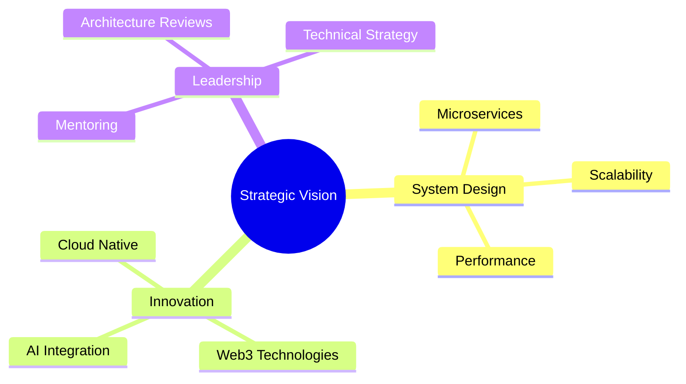

# 👋 Hi there, I'm Rama Anindya!

<div align="center">
  
</div>

<div align="center">
  <h1>
    
  </h1>
</div>

<div align="center">
  
</div>

<br/>

## ⚡ STRATEGIC OVERVIEW

```typescript
interface Developer {
  mindset: 'Architect' | 'Strategist' | 'Systems Thinker';
  experience: '3+ Years Building Scalable Solutions';
  focus: 'Long-term Vision, Efficient Execution';
  philosophy: 'Perfect is the enemy of good, but good is the enemy of great';
}

const RamaAnindya: Developer = {
  location: '🇮🇩 Indonesia',
  mbti: 'INTJ-A',
  currentMission: 'Engineering elegant solutions for complex problems',
  expertise: [
    'System Architecture',
    'Full-Stack Development',
    'Strategic Planning',
  ],

  stack: {
    frontend: ['React', 'Next.js', 'TypeScript', 'Tailwind'],
    backend: ['Node.js', 'Python', 'PHP Laravel', 'Java Spring'],
    database: ['PostgreSQL', 'MongoDB', 'Redis'],
    cloud: ['AWS', 'Docker', 'CI/CD'],
    tools: ['Git', 'Linux', 'VS Code'],
  },

  currentlyBuilding: 'Next-generation web applications',
  openTo: [
    'Strategic partnerships',
    'Complex problem solving',
    'Innovation projects',
  ],
};
```

<br/>

## 🎯 CORE COMPETENCIES

<div align="center">

### FRONTEND MASTERY

[](https://reactjs.org/)
[](https://nextjs.org/)
[](https://www.typescriptlang.org/)
[](https://tailwindcss.com/)

### BACKEND ARCHITECTURE

[](https://nodejs.org/)
[](https://www.python.org/)
[](https://laravel.com/)
[](https://spring.io/)

### DATA & CLOUD

[](https://www.postgresql.org/)
[](https://www.mongodb.com/)
[](https://aws.amazon.com/)
[](https://www.docker.com/)

</div>

<br/>

## 📊 PERFORMANCE METRICS

<div align="center">
  
  
</div>

<div align="center">
  
</div>

<br/>

## 🔮 STRATEGIC FOCUS

<div align="center">



</div>

<br/>

## 🌐 PROFESSIONAL NETWORK

<div align="center">
  <a href="mailto:ramaanindyaa@gmail.com">
    
  </a>
  <a href="https://linkedin.com/in/ramaanindyaa">
    
  </a>
  <a href="https://github.com/ramaanindyaa">
    
  </a>
</div>

<br/>

## 💭 PHILOSOPHY

<div align="center">
  <i>"The best code is not just functional—it's elegant, maintainable, and strategically sound."</i>
  <br/><br/>
  
</div>

<div align="center">
  
</div>
